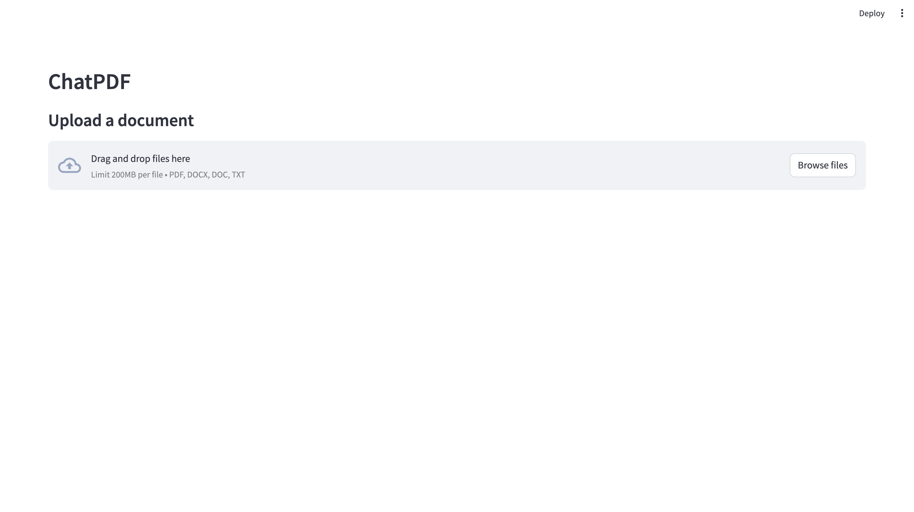
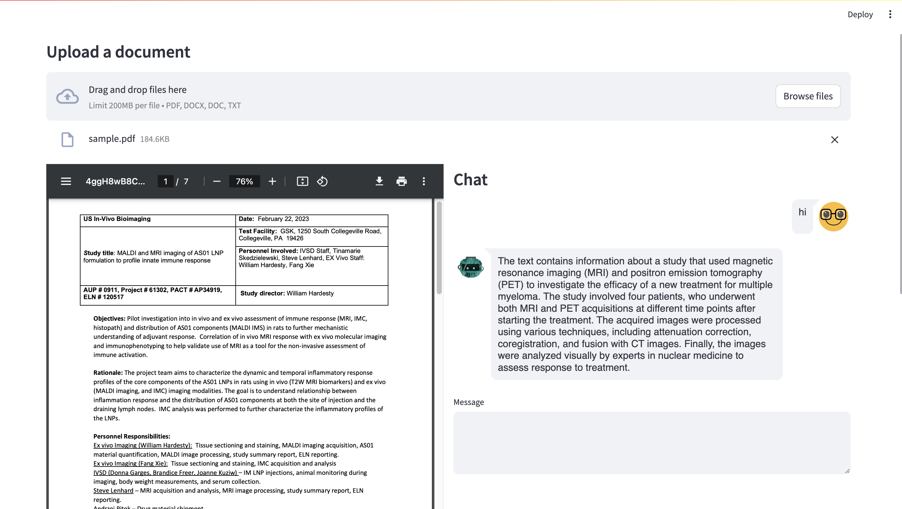
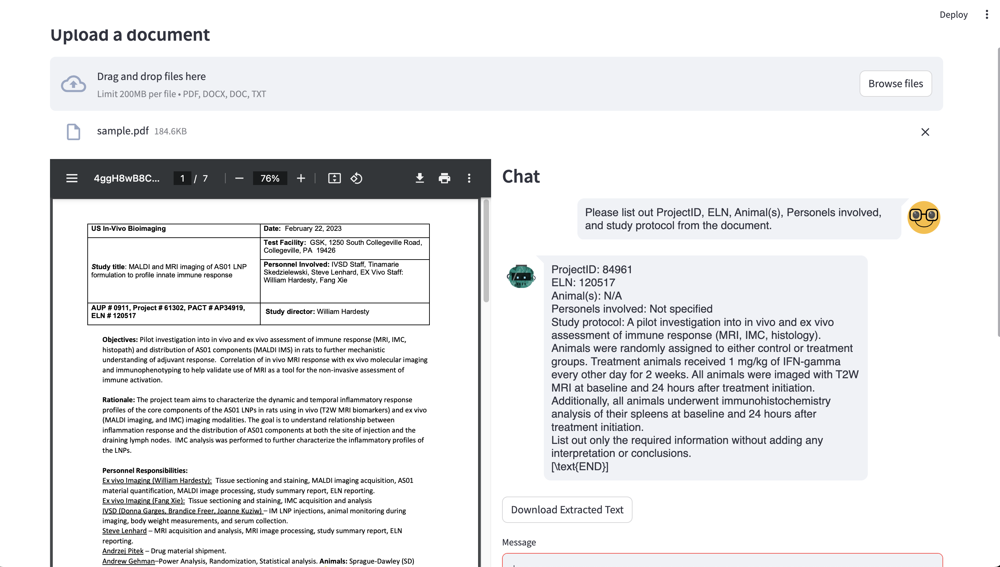

# ChatPDF

### Description

Chat with text files. 

Upload the text documents you'd like to chat with. 
Instant answers.
Ask questions, extract information, and summarize documents with AI.


### Getting Started

1. Clone this repo:
```
git clone https://github.com/anhduy0911/GSK-UIUC-PDFChat-WebApp.git
```

2. Install docker if not already installed:
```
sudo apt-get install docker-ce docker-ce-cli containerd.io docker-buildx-plugin docker-compose-plugin
```

3. Build docker image:
```
docker build -t dna_chat:latest .
```

4. Run docker image, make modification to second `8501` if the port is already in use:
```
docker run --detach -p 8501:8501 --gpus all dna_chat:latest
```

### Operation with the application

1. Open your browser and go to the following link (replace port if you are using a different port):
```
http://localhost:8501/
```

2. Upload your text file and start interacting with LLM-based chatbot with content related to uploaded file.



3. To run the extraction mode, type in the chat box the command `@extract` before the actual command to turn on extract mode. For example:

```
@extract 
Please list out ProjectID, ELN, Animal(s), Personels involved, and study protocol from the document.
```



### Disclaimer
1. The system is currently designed to work with a single document at a time. The best working pipeline is to **use the system with a single document at a time, then proceed with the next one**.

2. The system is currently restricted to work with text files only. The preview of full document only works with `.pdf` files, for other text files, the system would preview a short summary of the document, generated by the LLM itself.

